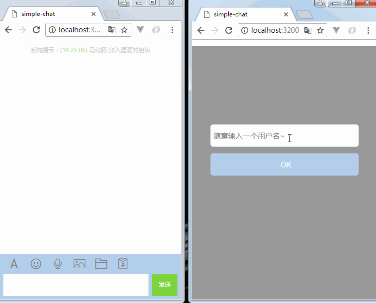

# SimpleChat
+ <code>Has been installed node</code>
+ <code>clone this repository</code>
+ <code>npm install</code>
+ <code>npm run server</code>
+ <code>The browser opens http://localhost:3200/</code>
+ 
